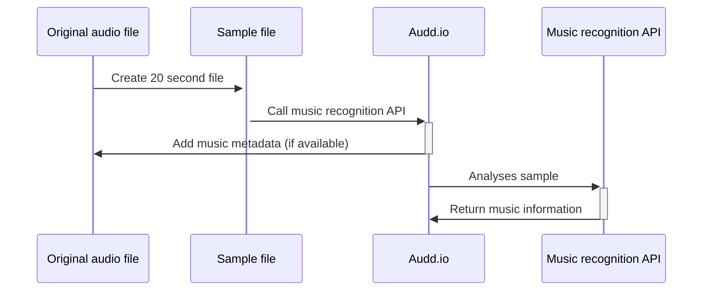

# music-metadata-updater

A CLI script which takes a list of audio files, detects the track information, and then adds the information as metadata to the original file.

## Requirements

You will need:

* NodeJS (v16.13.2 is used here)

## Usage

* `npm install`
* `npm run start [ONE OR MORE AUDIO FILE PATHS]`

## Example

`npm run start ~/Downloads/song.m4a`

## Architecture

